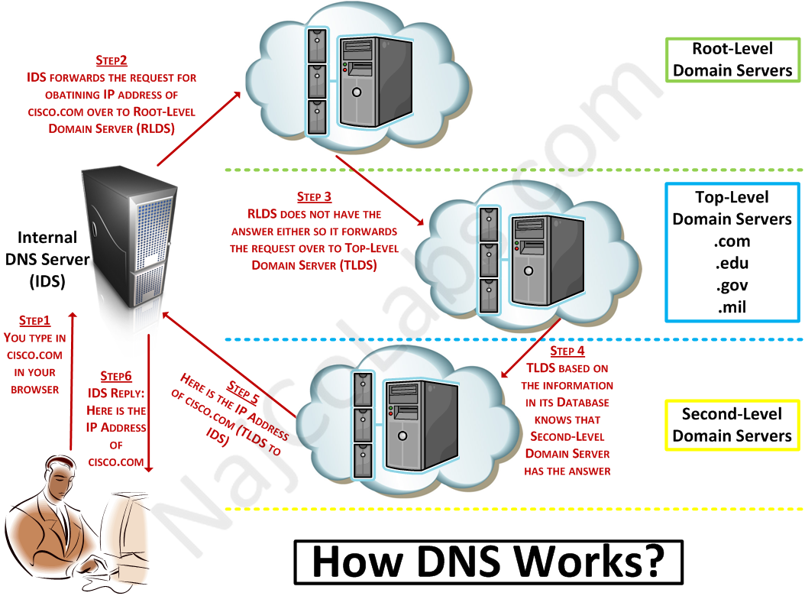

# DNS

**DNS (Domain Name System)** is a distributed service that looks up an IP for a given domain name. For example `www.google.com` is actually `74.125.29.101`.

## DNS is a hierarchically distributed system

DNS is composed of three types of servers: domain servers, global top level domain name servers and the root servers. Root servers have a database mapping IPs to global top level domains, which in turn have a database mapping IPs to domains. Each domain may also have it's own name server, which maps its various subdomains to different IPs (servers).



### Local Caching

When a connection is to be initialized with a domain, the process which is seeking the connection asks the operating system, which has a built-in 'resolver', for the IP. If the IP is not already cached, it must be looked up via DNS. Caching is also done by the ISP (Internet Service Provider). When a DNS request is made, the ISP first checks it's own cache. If the IP is available, it is returned. Otherwise, it recursively gets the IP starting at the root server.

Caching of an IP is usually quite short lived as each mapping has a set lifecycle which expires after say 60 seconds after which it must be re-cached.

### Root Server

When an IP is first resolved, the operating system queries the root server (which it always has the IP of) for the NS record of the *top level domain* (or TLD) of the requested domain. For google.com this would be 'com'.

### Top Level Domain

The returned NS record contains the address of the TLD NS, which maintains a list of all domains in its level.

### Domain

Once the TLD Name Server IP is resolved, the operating system will query that server for the NS record of the domain name server. This NS record is returned to the OS. This final NS record contains the IP of the Domain Name Server, which contains the IPs of all servers running on it.

### Host

Finally, the domain name server is queried, it returns the A record of the host.

## Definitions

### Common DNS Record Types

* A - maps a domain name to the IP (IPv4) address of a computer hosting the domain
* CNAME - Canonical Name. Used to alias to another domain
* AAAA (quad-A) - (IPv6) domain -> IP mapping
* NS - server component of DNS, tells which DNS servers have records for that domain

### DNS Distribution

Nesting example:
```
'A' record for www.greenspaceghost.com contains the IP
	-> resides in greenspaceghost.com name server
		-> resides in com (global tld) name server
			-> resides on root server
```
